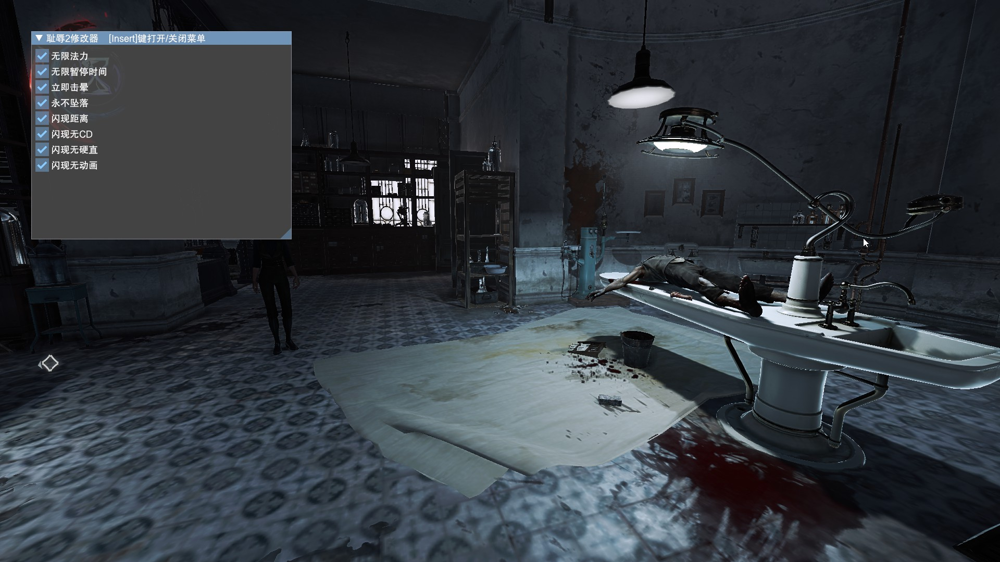

# Dishonored 2 Trainer / 符文工房3修改器



## 下载

https://github.com/vSylva/dishonored_2_trainer/releases

## 使用方式

将 **d3d11.dll** 放入游戏根目录中，启动游戏等待游戏窗口正常化后会自动显示UI

## 备注

游戏版本: 1.77.9.0

## 编译

安装 Visual Studio 2022 C++ 构建工具

安装 Rust 工具链

git clone https://github.com/vSylva/rune_factory_3_trainer.git

```rust
cargo +stable build --release
```

## Reference/引用

https://fearlessrevolution.com/viewtopic.php?f=4&t=194
